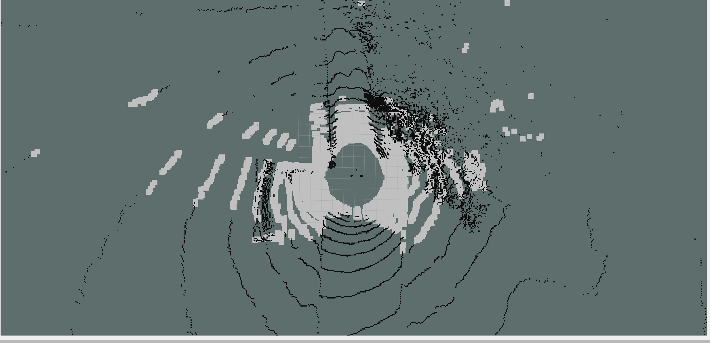

# 3D Lidar Mapping Stack
This repository contains the ROS packages for 3D Lidar Mapping Stack. The stack is designed to work with the Clearpath Warthog robot equipped with a Ouster OS1-32 3D Lidar. The stack is designed to work with the ROS2 Humble distro.

## Inflation costmap output

>

The above output has 3 informations, the colorfull cells you see are the inflated cost cells, whose inflation radius is set as per robot's footprint. For instance the Warthog is 1.52m long and 1.38m wide. For a rectangular robot, the inflation radius should be set to cover the dimensions of the robot and include a safety margin. Since our robot has a rectangular frame with dimensions 1.52m long and 1.38m wide, you can set the inflation radius based on the half-diagonal of the rectangle to ensure that the entire robot footprint is covered.

$$
Inflation Radius = \frac{\sqrt{1.52^2 + 1.38^2}}{2} = 1.02m
$$
I kept the safe margin to round off this value upto 1.3m.

For free cells, they also needs to be inflated, hence for free cells the surrounding cells should also be classified as free if they are within the wheel radius so that the robot can safely traverse.

## Occupancy Grid
The occupancy grid contruction in this repo will publish a 2D occupancy grid from a 3D Lidar Point Cloud. The occupancy grid is published on the topic `/map` and can be visualized in RViz.Currently the pointclouds has been classified as `Z > 0` and `Z < 0`, and then Ray Tracing is performed for now to get the occupancy grid map running.

Algorithms like Principal Component Analysis (PCA) in which the pointclouds are projected on the ground plane and then the ground plane is segmented from the pointclouds can be used to get the ground plane. This approach tries to find the normal to every 3D point and depending on its thershold deviation from the ground plane, the point is classified as ground or non-ground. This approach has some algorithmic issues which needs to be resolved and will be updated soon.

Currently the naive ground support segmentation algorithm is used in which the ground plane is segmented by considering the points which are below a certain height from the robot's base and considering if those points have a valid ground support or not. viz if a specific point has `Z < 0.15m` which is the ground clearance of the robot it is classified as ground point. This approach is naive and will be updated soon with a better and Robust algorithm like PCA or RANSAC.

## Future Work
Although the current implementation and the above approaches work, they are kind of naive and does not account for uncertainties of the terrain, does not consider the slope of the terrain, does not implement a leaning algorithm to it. The future work will include the following:
- Implementing a robust unsuopervised ground segmentation algorithm.
